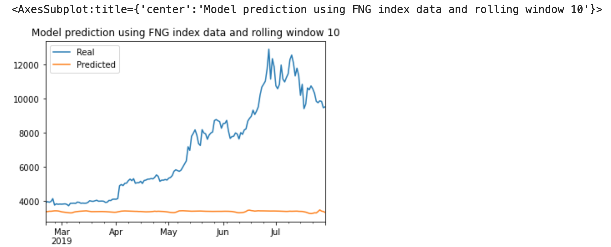
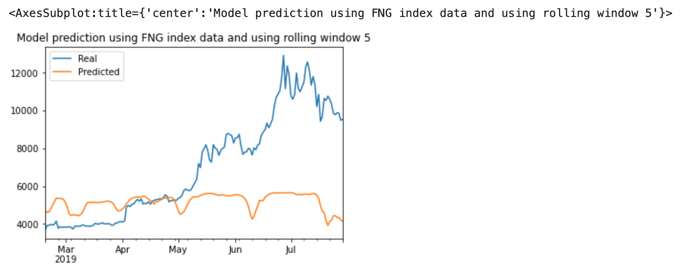
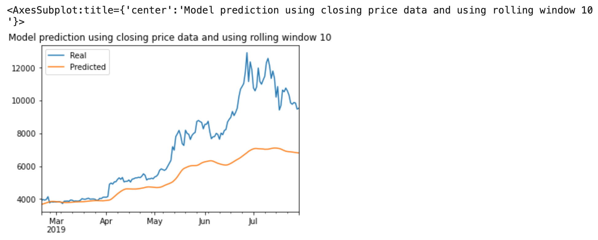
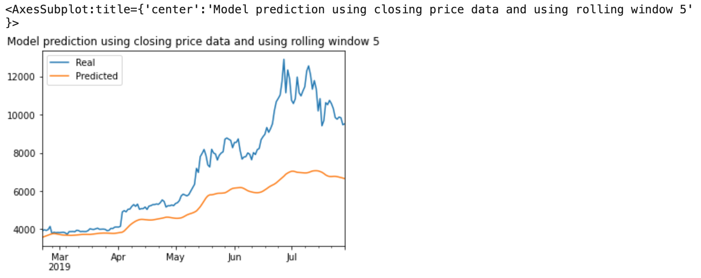

# LSTM Stock Predictor

Due to the volatility of cryptocurrency speculation, investors will often try to incorporate sentiment from social media and news articles to help guide their trading strategies. One such indicator is the [Crypto Fear and Greed Index (FNG)](https://alternative.me/crypto/fear-and-greed-index/) which attempts to use a variety of data sources to produce a daily FNG value for cryptocurrency.

Build and evaluate deep learning models using both the FNG values and simple closing prices to determine if the FNG indicator provides a better signal for cryptocurrencies than the normal closing price data.

Use deep learning recurrent neural networks to model bitcoin closing prices. One model will use the FNG indicators to predict the closing price while the second model will use a window of closing prices to predict the nth closing price.

1. Prepare the data for training and testing
2. Build and train custom LSTM RNNs
3. Evaluate the performance of each model

Use the FNG values to try and predict the closing price. 
Use previous closing prices to try and predict the next closing price.

Each model will use 70% of the data for training and 30% of the data for testing.

Apply a MinMaxScaler to the X and y values to scale the data for the model.

Finally, reshape the X_train and X_test values to fit the model's requirement of samples, time steps, and features. (*example:* `X_train = X_train.reshape((X_train.shape[0], X_train.shape[1], 1))`)

### Build and train custom LSTM RNNs

Create the same custom LSTM RNN architecture. 
This is done using a function that does all the below steps
1) generate of feature data using window size, 
2) split data for training and testing
3) Scale and reshape the data
4) build and train LSTM model
5) evaluate performance
6) Predict Closing Prices using a 10 day window of previous values (FNG and Closing price data)

This function is then invoked multiple times using different values for windoe timeframe to compare the results

In one notebook, fit the data using the FNG values. In the second notebook, fit the data using only closing prices.

Use the same parameters and training steps for each model. This is necessary to compare each model accurately.

### Evaluate the performance of each model

Finally, use the testing data to evaluate each model and compare the performance.

Which model has a lower loss?

***Using similar models on data based on FNG index and Closing price, the model has lower loss when using closing price***

- Model using FNG index, rolling window 10 loss : 0.3022
- Model using FNG index,, rolling window 20 loss : 0.2962
- Model using FNG index,, rolling window 5 loss : 0.1513
- Model using FNG index,, rolling window 50 loss : 0.3810

- Model using closing price, rolling window 10 loss : 0.0785
- Model using closing price, rolling window 20 loss : 0.0776
- Model using closing price, rolling window 5 loss : 0.0833
- Model using closing price, rolling window 50 loss : 0.0882

Which model tracks the actual values better over time?

***The model using closing price tracks the values better over time***

Which window size works best for the model?

***For the model that uses FNG index, smaller window size works better i.e less loss.
However, for the model that uses closing prices, the window size does not make much difference***

***Model predictions for 10 day rollinwg window using FNG index data***

***Model predictions for 5 day rollinwg window using FNG index data***

***Model predictions for 10 day rollinwg window using Closing price data***

***Model predictions for 5 day rollinwg window using Closing price data***

